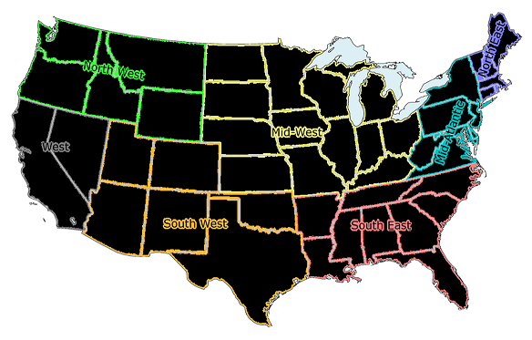

```{r setup, load-packages, include=FALSE}
knitr::opts_chunk$set(echo = FALSE)
knitr::opts_chunk$set(warning = FALSE)
knitr::opts_chunk$set(eval = TRUE)
```
### Project Team: AJA Analytics
### Client: Budweiser Breweries
### Project Description: Beer Opportunity and Data Analysis
##### GitHub Repository: https://github.com/GeekyGurlzRock/MSDS_6371_Project1.git


### Introduction

The AJA Analytics team was contracted by Budweiser Breweries to assist with a preliminary data gathering, analysis and exploration for the company's planned New Brewery Project.  The goal of this initiative is to assess the beer and brewery market data, identify trends and advice on opportunities to monetize the findings.

It is known that there is a growing interest in specialized beer strengths and flavors.  These emerging trends, coupled with other economic factors make this initiative a very promising investment.  We recommend expanding in under-served markets and embarking on a robust marketing strategy targeting key growth areas, guided by a data driven effort to improve sales and increase revenue.


**Datasets **
  
* **Beers dataset:** The Beers data set contains a list of 2410 beers brands currently being produced in the United States including Alcohol content (ABV), Beer ID, International Bitterness Units (IBU), Style, Ounces and associated Brewery ID.  

* **Breweries dataset:** The Breweries data set contains a list of 558 Breweries including Brew_ID, headquarter city  and State.

The project's [CODEBOOK](https://github.com/GeekyGurlzRock/MSDS_6371_Project1.git/master/CodeBook.md) contains a more detailed listing of all attributes used.  

### Methodology  
To undertake the Exploratory Data Analysis, AJA Analytics chose R software as the preferred statistical software environment to gather, clean, explore and summarize the data sets.  

The datasets were received in a csv file format and a preliminary review of the files showed that the data was well organized though incomplete.  

First, we used the Breweries data set and developed a summary table listing the number of breweries in each state.  As seen in the Table 1.1 Breweries by State, represented as a heatmap, there is a wide range in number of breweries by state. Colorado leads the way with 47 breweries and South Dakota is among the states with the least breweries.

```{r DirectorySet, eval= FALSE}
########################## Initialize Directories ###################################
setwd(dirname(rstudioapi::getActiveDocumentContext()$path))
```


```{r LoadingFiles, echo=FALSE,include=F}
library(knitr)
library(ggplot2)
library(fiftystater)
library(mapproj)
library(tidyr)
library(grid)
library(gridExtra)
library(kableExtra)
library(magick)
library(magrittr)
library(tidyverse)
######################## Loading In data file Beers.csv################### 

Beers = read.csv('Beers.csv',header = T,sep = ",")

######################### Loading in data file Breweries.csv. File #################

Breweries = read.csv('Breweries.csv',header = T,sep = ",")

colnames(Breweries) = c("Brewery_id","Brewery Name","City","State")

beertypes = read.csv('BeerStyles.csv',header = T,sep = ",")

```


Bright red represents the states with the most breweries, while black represents those states with less breweries as seen in Figure 1.1 below.


```{r, echo= F, comment= NA, message=F, include=T , fig.align = 'center',fig.cap = 'Figure 1.1: Number of Breweries by state across the United States'}


########################  Map with Number of Breweries Across States ########
Brewweries_by_State = table(Breweries$State)
Breweries_Map <- as.data.frame(Brewweries_by_State)
names(Breweries_Map) =  c("state","Breweries")
Breweries_Map$state = trimws(Breweries_Map$state)
Heatmap_Regions = read.csv('Heatmap_Regions.csv',header = T,sep = ",")
Breweries_Map = merge(Breweries_Map,Heatmap_Regions, by ="state", all=TRUE)

##################### Plotting heat map of the United states with varying degrees of shade for Brewery Count ##########################

Mapplot = Breweries_Map %>% ggplot(aes(map_id = region)) + 
  geom_map(aes(fill = Breweries), map = fifty_states) + 
  expand_limits(x = fifty_states$long, y = fifty_states$lat) +
  coord_map() + scale_x_continuous(breaks = NULL) + 
  scale_y_continuous(breaks = NULL) + labs(fill = "Number\nof\nBeweries\nAcross\nthe\nUnited_States",
       x = "", y = "") +
  scale_fill_continuous(low = "black", high = "red", guide="colorbar")+
  theme(legend.position = "bottom", 
        panel.background = element_blank(),
        plot.title = element_text(hjust = 0.5)) +
fifty_states_inset_boxes()

Mapplot


```


There are states that do not have many breweries, so our team made the decision to group the states based on their region within the US. Our goal was to use these regions to summarize that demographic. We have seven different regions as seen in Figure 1.2: Northwest, West, Southwest, Midwest, Southeast, Mid-Atlantic, and Northeast.


```{r, echo= F, comment= NA, message=F, include=T , fig.align = 'center',fig.cap = 'Figure 1.2: United States by Regions'}


library(magick)
Regional_Photo <- image_read('RegionsImage.png') %>% image_scale('x500')

```


### Data Cleansing and Preparation 


```{r, echo= F, comment= NA, message=F, include=F , fig.align = 'center'}
############################# Read the Tables ###################################
library(doBy)

Beers <- data.frame(Beers)


Breweries <- data.frame(Breweries)


regional = read.csv('Regions.csv', header = TRUE, sep = ",")
regional <- data.frame(regional)


############################### MERGING THE DATASETS NO. 2  ###############

##################################### Joining the Beer and Brewery Data sets by the Brewery ID ##########

both <- merge(Beers, Breweries, by.x = "Brewery_id", by.y = "Brewery_id")

```


Tables 1.1 and 1.2 show the first six observations and last six observations of the merged beer and breweries dataset.  Table 1.1 illustrates all of the available data values within our combined dataset.


```{r, echo= F, comment= NA, message=F, include=T , fig.align = 'center',fig.cap = 'Table 1.1: Sample data: First 6 Observations ~ Beers with Breweries'}

bothDataFirst <- head(both,6)
knitr::kable(bothDataFirst, caption = "Table 1.1: Sample data: First 6 Observations ~ Beers with Breweries") %>% kable_styling(font_size = 10)
```


As seen in Table 1.2, there are "NA" values for the IBU variable. This denotes a missing value. There were a total of 1067 missing values: 62 in Alcohol Content (ABV) and 1005 in Bitterness (IBU).  We replaced the missing values with the median (middle value) based on the style of beer. If the median for the beer population was zero (0), then we would use the average. This occurred for some beers that were sweet with low alcohol content. 

Once the regions were integrated, and the missing values adjusted, we explored the characteristics of Bitterness and Alcohol Content by regional demographic and state.


```{r, echo= F, comment= NA, message=F, include=T , fig.align = 'center',fig.cap = 'Table 1.2: Sample data: Last 6 Observations ~ Beers with Breweries'}

bothDataLast <- tail(both,6)
knitr::kable(bothDataLast, caption = "Table 1.2: Sample data: Last 6 Observations ~ Beers with Breweries") %>% kable_styling(font_size = 10)
```


```{r, echo= F, comment= NA, message=F, include=F , fig.align = 'center'}
######################### MISSING VALUES NO. 3 #################


######################### Find Medians based on type #################################################
  bothClean <- na.omit(both)
  ibuStyle <- summaryBy(IBU ~ Style, data = bothClean,FUN = list(max, min, median, mean))
  abvStyle <- summaryBy(ABV ~ Style, data = bothClean,FUN = list(max, min, median))

########## Using the IBU and ABV statistics calculated, we can replace those values using this code.#######################
 
  both <- merge(both, ibuStyle, by= "Style")
  both$IBU[is.na(both$IBU)] = 0
  both$CleanIBU <- ifelse(both$IBU != 0, both$IBU, both$IBU.median)
  both$CleanIBU <- ifelse(both$IBU == 0, both$IBU.mean, both$CleanIBU)
  #sum(is.na(both$CleanIBU))

  both <- merge(both, abvStyle, by= "Style")
  both$ABV[is.na(both$ABV)] = 0
  both$CleanABV <- ifelse(both$ABV != 0, both$ABV, both$ABV.median)
  #sum(is.na(both$CleanIBU))
  
```


```{r, echo= F, comment= NA, message=F, include=F , fig.align = 'center'}

################### Question 4 - What is the Distributions of Medians for ABU and IBV ####################################
################### Question 5 - Max ABV and Max IBU for States ##########################################################
  
  abvReg <- data.frame(merge(both, regional, by = "State")) 
  ibuReg <- data.frame(merge(both, regional, by = "State"))
  bothReg <- data.frame(merge(both, regional, by = "State"))
  bothStyleReg <- data.frame(merge(bothReg, beertypes, by.x = "Style", by.y = "Style"))


##################Creating Data Frames that contain the Median, Max and Min values of ABV and IBU for State then Region ######
  
  abvStats <- summaryBy(CleanABV ~ State, data = abvReg,FUN = list(max, min, median))
  ibuStats <- summaryBy(CleanIBU ~ State, data = ibuReg,FUN = list(max, min, median))
  abvStatsReg <- summaryBy(CleanABV ~ Region, data = abvReg,FUN = list(max, min, median, mean))
  ibuStatsReg <- summaryBy(CleanIBU ~ Region, data = ibuReg,FUN = list(max, min, median, mean))
```

### Data Characteristics

#### Bitterness

Evaluating bitterness as measured by the International Bitterness Unit, or IBU, the bar chart displayed in Figure 2.1 depicts the medians of Bitterness across the Region. The gold line over the bars displays the range of the IBU with the bottom being the lowest observation recorded in that region and the top of the gold line representing the largest observation recorded in that region. It is evident the median values are nearly uniform.  The Midwest is the lowest median value, therefore they tend to brew less bitter beers. The Northwest has the largest observation recorded for bitterness.
  
```{r, echo= F, comment= NA, message=F, include=T , fig.align = 'center',fig.cap = 'Figure 2.1: Distribution of Medians for International Bitterness Unit (IBU) by Region'}


################ Creating the bar charts with error bars to show the median, max, and min of each state and region #########################
  
  
  ibuStatsReg %>% ggplot(aes(x=Region, y=CleanIBU.median)) + geom_bar(stat = "identity", position = "dodge")+ geom_errorbar(aes(x=Region, ymin=CleanIBU.min, ymax=CleanIBU.max), color = "gold") + theme_dark() + scale_fill_manual(values = c("blue")) + ylab("International Bitterness Unit Median")
  
```

Figure 2.2 is broken down by State. Wisconsin has the lowest Median IBU at 19, therefore we could infer that based on this sample, they would prefer less bitter beers, whereas Maine has the largest with 61. Even though Maine has the largest Median of Bitterness, it did not contain the most bitter unit, it was Oregon's Bitter Bitch Imperial IPA with an IBU of 138.


```{r, echo= F, comment= NA, message=F, include=T , fig.align = 'center',fig.cap = 'Figure 2.2: Distribution of Medians for International Bitterness Unit (IBU) by State'}


ibuStats %>% ggplot(aes(x=State, y=CleanIBU.median)) + geom_bar(stat = "identity", position = "dodge")+ geom_errorbar(aes(x=State, ymin=CleanIBU.min, ymax=CleanIBU.max), color = "gold") + theme_dark() + scale_fill_manual(values = c("blue")) + ylab("International Bitterness Unit Median") + theme(axis.text.x = element_text(angle = 90))


```

#### Alcohol by Volume

The alcoholic content by region is depicted in Figure 3.1, the Median values are the bars and the range of minimum and maximum observation are represented by the gold line. Each region appears to be uniformly distributed, they have similar median values, the Southwest has the largest observation of alcohol by Volume.


```{r, echo= F, comment= NA, message=F, include=T , fig.align = 'center',fig.cap = 'Figure 3.1: Distribution of Medians for Alcohol By Volume (ABV) by Region'}

abvStatsReg %>% ggplot(aes(x=Region, y=CleanABV.median, color= "red")) + geom_bar(stat = "identity", position = "dodge", show.legend = FALSE) + geom_errorbar(aes(x=Region, ymin=CleanABV.min, ymax=CleanABV.max), color = "gold") + theme_dark() + scale_fill_manual(values = c("red", "blue")) + ylab("Alcohol by Volume Median")

```

These characteristics at the State level can be seen in Figure 3.2. Maine and West Virginia have the largest median values meaning they enjoy strong beers whereas Wisconsin and Kansas have the lowest, meaning they do not typically brew stronger beers.  This is based on the assumption that the breweries sampled are representative of the population. The largest value recorded was 12.8% alcohol content in the Southwest region from a beer called Lee Hill Series Vol. 5 of Colorado. 


```{r,  echo = FALSE, message = FALSE, include = T, comment= NA,  fig.align = 'center', fig.cap="Figure 3.2: Distribution of Medians for Alcohol By Volume by State"}


abvStats %>% ggplot(aes(x=State, y=CleanABV.median, color= "red")) + geom_bar(stat = "identity", position = "dodge",show.legend = FALSE) + geom_errorbar(aes(x=State, ymin=CleanABV.min, ymax=CleanABV.max), color = "gold") + theme_dark() + scale_fill_manual(values = c("red", "blue")) + ylab("Alcohol by Volume Median")  + theme(axis.text.x = element_text(angle = 90))
  

######################## Creating a new data set for the summary statistics ######################################################
  
  abvCompleteStats <- summaryBy(CleanABV ~ Region, data = abvReg, FUN = list(max, min, median, mean, var))
  

```


#### Summary Statistics

The boxplot in Figure 3.3 visualizes the summary statistics for the alcohol content by region. The regions with the smaller boxes mean the alcohol content in that region is less varied, while the regions with a larger box means they have more variation within the alcohol content. The black line represents the median alcohol content for that region. We can see, there are some extremities depicted by the black dots on the graphic. Those observations are beers outside of the most observed.


```{r,  echo = FALSE, message = FALSE, include = T, comment= NA,  fig.align = 'center', fig.cap="Figure 3.3:The Distributions of ABV by Regions of the United States"}

############################# Question 6 - boxplot of ABV ########################################################################
  
bothReg %>% ggplot(aes(x=Region, y=CleanABV, fill = Region)) + geom_boxplot() + theme_dark()
  
```


### Data Relationships

Figure 4.1 shows the relationship of alcohol content and bitterness for all regional data. We can see the data points cluster around 0.05 ABV and a bitterness of 25. 


```{r,  echo = FALSE, message = FALSE, include = T, comment= NA,  fig.align = 'center', fig.cap="Figure 4.1: ABV vs IBU all Regions"}
################################ Question 7 #####################################################################

bothReg %>% ggplot(aes(x=CleanABV, y=CleanIBU, color = Region)) + geom_point(position = "jitter") + theme_dark()
```  

Visualizing the ABV and IBU relationship by regions displays the characteristics with more clarity. The West and Northwest regions shows a strong linear relationship between ABV and IBU, therefore we could assume that as bitterness increases the alcohol content does as well.


```{r,  echo = FALSE, message = FALSE, include = T, comment= NA,  fig.align = 'center', fig.cap="Figure 4.2: ABV vs IBU by Region"}


bothReg %>% ggplot(aes(x=CleanABV, y=CleanIBU, color = Region)) + geom_point(position = "jitter") + geom_smooth(method = "lm") + facet_wrap(~Region) + theme_dark()
  
```


### Beer Classifications

#### Optimizing Prediction Model


```{r, comment= NA, echo= F, message= F, include= F, fig.align = 'center'}

library(class)
library(caret)
library(dplyr)
library(plyr)

BeerSubset_Train <- dplyr::filter(both, grepl('IPA|Ale', both$Style))

sum(is.na(BeerSubset_Train))

BeerSubset_Train$Type <- if_else(grepl('IPA', BeerSubset_Train$Style),"IPA","ALE")

BeerSubset_Train_clean <- remove_missing(BeerSubset_Train)

###################### BeerIPA <- filter(BeerSubset_clean, Type =='IPA')##########################

######################### BeerALE_Test <- filter(BeerSubset_Train_clean, Type =='ALE') ###############################

############################# Question 8 ############################################################################

########################### Filter only for IPA and ALE type beers ###################################################

BeerSubset_Train <- dplyr::filter(both, grepl('IPA|Ale', both$Style))

sum(is.na(BeerSubset_Train))

BeerSubset_Train$Type <- if_else(grepl('IPA', BeerSubset_Train$Style),"IPA","ALE")

BeerSubset_Train_clean <- remove_missing(BeerSubset_Train)

###################### BeerIPA <- filter(BeerSubset_clean, Type =='IPA')##########################

######################### BeerALE_Test <- filter(BeerSubset_Train_clean, Type =='ALE') ###############################

set.seed(6)
splitPerc = .70
iterations = 100
numks = 10

masterAcc = matrix(nrow = iterations, ncol = numks)


for(j in 1:iterations)
{
  trainIndices = sample(1:dim(BeerSubset_Train_clean)[1],round(splitPerc * dim(BeerSubset_Train_clean)[1]))
  train = BeerSubset_Train[trainIndices,]
  test = BeerSubset_Train[-trainIndices,]
  
  for(i in 1:numks)
  {
    classifications = knn(train[,c(15,19)],test[,c(15,19)],train$Type, prob = TRUE, k = i)
    table(classifications,test$Type)
    CM = confusionMatrix(table(classifications,test$Type))
    masterAcc[j,i] = CM$overall[1]  
  }  
  
}


MeanAcc = colMeans(masterAcc)

```


Exploring the relationship between the ABV and IBU, we tested whether we can predict if a beer is an IPA or an Ale. We used a k-nn classifier which predicts the style of beer using the closest values to the one we are considering. The value "k" tells us how many values it uses to decide whether it is an IPA or Ale. We tested a range of k nearest neighbors to determine the optimal number of values required to classify the beer as an IPA or Ale most accurately.  The most accurate k-nn classifier is 5, as depicted by the line graph illustrated in Figure 5.1.


```{r,  echo = FALSE, message = FALSE, include = T, comment= NA,  fig.align = 'center', fig.cap="Figure 5.1: The Mean K-NN Value Line graph"}
plot(seq(1,numks,1),MeanAcc, type = "l")

```


```{r, echo= F, comment= NA, message=F, include=F, fig.align = 'center'}

library(dplyr)
library(class)
library(caret)

############################# Question 8 ############################################################################

########################### Filter only for IPA and ALE type beers ###################################################

BeerSubset_Train <- dplyr::filter(both, grepl('IPA|Ale', both$Style))

#sum(is.na(BeerSubset_Train))

BeerSubset_Train$Type <- if_else(grepl('IPA', BeerSubset_Train$Style),"IPA","ALE")

#BeerSubset_Train_clean <- remove_missing(BeerSubset_Train)

set.seed(6)
splitPerc = .70

trainIndices = sample(1:dim(BeerSubset_Train_clean)[1],round(splitPerc * dim(BeerSubset_Train_clean)[1]))
train = BeerSubset_Train[trainIndices,]
test = BeerSubset_Train[-trainIndices,]

accs = data.frame(accuracy = numeric(100), k = numeric(100))

for(i in 1:100)
{
  classifications = knn(train[,c(15,19)],test[,c(15,19)],train$Type, prob = TRUE, k = i)
  table(test$Type,classifications)
  CM = confusionMatrix(table(test$Type,classifications))
  accs$accuracy[i] = CM$overall[1]
  accs$k[i] = i
}

accs$k & accs$accuracy

test$Result <- knn(train[,c(15,19)],test[,c(15,19)],train$Type, prob = TRUE, k = 5)

CF <- confusionMatrix(table(test$Type,classifications))


```

#### Predicting Beer Type by Characteristic 

Since the optimal "k" value is equal to 5, we plotted a scatterplot of the output. The scatterplot in Figure 5.2 displays the predicted values of Ale and IPA based on their IBU and ABV. We can see a strong relationship where the Ales typically have less bitterness and less alcohol by volume whereas the IPA has more bitterness and alcohol content. The Ale threshold, as observed in Figure 5.2 occurs when bitterness is less than 50 and when alcohol by volume is below 6.5%.

```{r,  echo = FALSE, message = FALSE, include = T, comment= NA,  fig.align = 'center', fig.cap="Figure 5.2: Scatterplot of the K-NN Results"}

test %>% ggplot(aes(x = CleanABV, CleanIBU,color = Type)) + geom_point() + geom_smooth(method = "lm") + theme_dark() + xlab("Alcohol by Volume") + ylab("International Bitterness Unit")

```

#### Classificaton Model Performance

In Figure 5.3, we see the confusion matrix and model statistics from the predictions using the k-nn classifier with a k value of 5. This tells us that there were 268 Ales and 141 IPAs that were accurately predicted, with 32 Ales and 19 IPAs that were inaccurately predicted. This gives us an 89% accuracy of the predicted values, which is adequate for a classification model. 


```{r,  echo = FALSE, message = FALSE, include = T, comment= NA,  fig.align = 'center', fig.cap="Figure 5.3: Confusion Matrix and Classification Model Performance Statistics"}

CF

```

### Beers by Category 

#### Findings
Assuming the proportions of beer styles brewed in each region do not represent consumer preference, we would recommend promoting a new line of brews that fit the Belgian or Wild Sour Ale characteristics, since these appear to be underrepresented across beer types.


```{r,  echo = FALSE, message = FALSE, include = T, comment= NA,  fig.align = 'center', fig.cap="Figure 5.4: IBU vs. ABV by beer Category"}

##########Displays the scatter plot of IBU vs. ABV by beer Category without OTHER
bothStyleReg <- data.frame(bothStyleReg[bothStyleReg$Category !='Other',])
bothStyleReg %>% ggplot(aes(x=CleanABV, y=CleanIBU, color = Category)) + geom_point(position = "jitter") + theme_dark()


```


### Recommendations

Assuming beers brewed by regions closely align to customer preference, we would recommend for Budweiser to expand its offering in the types of beers represented by the largest portions of the pie chart.  

They should allocate resources on marketing to increase market share and monetize popularity of specific brews in those regions. For instance, we would recommend for Budweiser to make an IPA specifically targeting the Northwest, Northeast, West and Midwest regions of the United States, because consumers in those regions prefer IPA over all the other styles of beer.


```{r,  echo = FALSE, message = FALSE, include = T, comment= NA,  fig.align = 'center', fig.cap="Figure 6.1: Pie Chart of Beers by Category"}

bothStyleReg$Category = as.factor(bothStyleReg$Category)
bothStyleReg$Region = as.factor(bothStyleReg$Region)

TypePie <- data.frame(count(bothStyleReg, c("Region", "Category")))
TypePie %>% ggplot(aes(x='', y=freq, fill = Category)) + geom_bar(stat = "identity", width = 1, color = 'white') + coord_polar("y", start = 0) + theme_dark() + facet_wrap(~Region)


```

#### Conclusion

More data would need to be investigated before we could make a fully confident recommendation because of the missing data and inability to relate the beers to consumer preference.


If Budweiser's goal is to improve profits and expand market share, we recommend they release a new product that falls under the Dark Lager type of beer, targeting the Southwest and Midwest regions of the United States since they have larger proportions of this brew in comparison to the other regions.  
